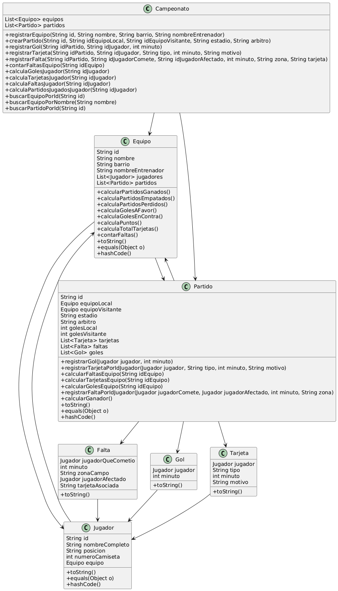

# Guía de Implementación: Sistema de Campeonato de Fútbol

A continuación, se presenta un orden sugerido para implementar los métodos pendientes en las clases `Campeonato.java`, `Equipo.java` y `Partido.java`. Cada sección agrupa métodos por funcionalidad para facilitar el desarrollo.


---
##Diagrama de clases




## Grupo 1: Fundamentos - Métodos de Búsqueda y Ayudantes 🔍

Estos métodos son esenciales ya que serán utilizados por muchas otras funcionalidades del sistema. Es crucial que funcionen correctamente antes de continuar.

1.  **Clase `Campeonato`**
    * `public Equipo buscarEquipoPorId(String id)`
        ```java
        /**
         * Busca un equipo por su ID.
         * @param id El ID del equipo a buscar.
         * @return El equipo encontrado, o null si no existe.
         */
        ```
    * `public Equipo buscarEquipoPorNombre(String nombre)`
        ```java
        /**
         * Busca un equipo por su nombre.
         * @param nombre El nombre del equipo a buscar.
         * @return El equipo encontrado, o null si no existe.
         */
        ```
    * `public Partido buscarPartidoPorId(String id)`
        ```java
        /**
         * Busca un partido por su ID.
         * @param id El ID del partido a buscar.
         * @return El partido encontrado, o null si no existe.
         */
        ```

2.  **Clase `Partido`**
    * `public Equipo obtenerEquipoJugador(String idJugador)`
        ```java
        /**
         * Devuelve el equipo al que pertenece el jugador.
         * Verifica que el jugador pertenezca a alguno de los equipos participantes en el partido, ya sea local o visitante.
         * @param idJugador El ID del jugador.
         * @return El equipo al que pertenece el jugador, o null si el jugador no se encuentra en ninguno de los equipos del partido.
         */
        ```

---

## Grupo 2: Gestión de Entidades Principales en el Campeonato 📝

Con los métodos de búsqueda listos, ahora puedes implementar la lógica para registrar equipos y crear partidos en el campeonato.

1.  **Clase `Campeonato`**
    * `public boolean registrarEquipo(String id, String nombre, String barrio, String nombreEntrenador)`
        ```java
        /**
         * Registra un nuevo equipo en el campeonato.
         * El equipo se crea con los datos proporcionados y se añade a la lista de equipos.
         * Si el ID del equipo ya existe, se retorna false.
         * Si el nombre del equipo ya existe, se retorna false.
         *
         * <p>Sugerencia de reutilización: {@link #buscarEquipoPorId(String)}, {@link #buscarEquipoPorNombre(String)}</p>
         *
         * @param id El identificador único del equipo. No debe ser nulo ni vacío.
         * @param nombre El nombre del equipo. No debe ser nulo ni vacío.
         * @param barrio El barrio del equipo. No debe ser nulo ni vacío.
         * @param nombreEntrenador El nombre del entrenador del equipo. No debe ser nulo ni vacío.
         * @return true si el equipo se registra correctamente, false si el ID o nombre ya existen, o si los parámetros son inválidos.
         */
        ```
    * `public boolean crearPartido(String id, String idEquipoLocal, String idEquipoVisitante, String estadio, String arbitro)`
        ```java
        /**
         * Crea un nuevo partido y lo añade al campeonato.
         * El equipo visitante no puede ser el mismo que el local.
         *
         * <p>Sugerencia de reutilización: {@link #buscarEquipoPorId(String)}, {@link #buscarPartidoPorId(String)}</p>
         *
         * @param id El identificador único del partido. No debe ser nulo ni vacío.
         * @param idEquipoLocal El ID del equipo local. Debe corresponder a un equipo ya registrado.
         * @param idEquipoVisitante El ID del equipo visitante. Debe corresponder a un equipo ya registrado.
         * @param estadio El nombre del estadio donde se juega el partido. No debe ser nulo ni vacío.
         * @param arbitro El nombre del árbitro del partido. No debe ser nulo ni vacío.
         * @return true si el partido se crea correctamente, false si el ID del partido ya existe,
         * si los equipos no se encuentran, o si el equipo local es el mismo que el visitante.
         */
        ```

---

## Grupo 3: Registro de Eventos de Partido (Impacto Directo en `Partido`) ⚡

Estos métodos se encargan de registrar los eventos que ocurren *dentro* de un partido específico y modifican el estado del objeto `Partido`.

1.  **Clase `Partido`**
    * El método `public boolean registrarGol(Jugador jugador, int minuto)` ya tiene una implementación parcial. Revisa y complétala asegurándote de que:
        * Valide que el jugador no sea nulo y el minuto sea positivo.
        * Utilice `obtenerEquipoJugador(jugador.getId())` para verificar la pertenencia del jugador al partido.
        * Cree y añada el objeto `Gol` a la lista `goles`.
        * Actualice `golesLocal` o `golesVisitante` según corresponda.

        ```java
        /**
         * Registra un gol para un jugador específico.
         * Si el jugador no pertenece a ninguno de los equipos participantes en el partido, se retorna false.
         * Si el jugador es del equipo local, se aumenta el número de goles del equipo local en 1.
         * Si el jugador es del equipo visitante, se aumenta el número de goles del equipo visitante en 1.
         *
         * <p>Sugerencia de reutilización: {@link #obtenerEquipoJugador(String)}</p>
         *
         * @param jugador El jugador que anotó el gol.
         * @param minuto El minuto en el que se anotó el gol.
         * @return true si el gol se registra correctamente, false en caso contrario.
         */
        ```
    * `public boolean registrarTarjetaPorIdJugador(Jugador jugador, String tipo, int minuto, String motivo)`
        ```java
        /**
         * Registra una tarjeta para un jugador específico.
         *
         * <p>Sugerencia de reutilización: {@link #obtenerEquipoJugador(String)}</p>
         *
         * @param jugador El jugador que recibe la tarjeta.
         * @param tipo El tipo de tarjeta (amarilla o roja).
         * @param minuto El minuto en el que se recibe la tarjeta.
         * @param motivo El motivo de la tarjeta.
         * @return true si la tarjeta se registra correctamente, false en caso contrario. // Asumiendo retorno boolean
         */
        ```
    * `public boolean registrarFaltaPorIdJugador(Jugador jugadorComete, Jugador jugadorAfectado, int minuto, String zona)`
        ```java
        /**
         * Registra una falta para un jugador específico.
         *
         * <p>Sugerencia de reutilización: {@link #obtenerEquipoJugador(String)}</p>
         *
         * @param jugadorComete El jugador que comete la falta.
         * @param jugadorAfectado El jugador que sufre la falta.
         * @param minuto El minuto en el que se comete la falta.
         * @param zona La zona en la que se comete la falta.
         * @return true si la falta se registra correctamente, false en caso contrario. // Asumiendo retorno boolean
         */
        ```

---

## Grupo 4: Interfaz del Campeonato para Registrar Eventos de Partido 📢

Estos métodos en la clase `Campeonato` servirán como la interfaz principal para que un usuario del sistema registre goles, tarjetas y faltas. Internamente, buscarán el partido correspondiente y luego, idealmente, delegarán la lógica de registro al objeto `Partido`.

1.  **Clase `Campeonato`**
    * `public boolean registrarGol(String idPartido, String idJugador, int minuto)`
        ```java
        /**
         * Registra un gol en un partido específico.
         * El idPartido debe ser un partido existente.
         * El idJugador debe ser un jugador existente en alguno de los equipos del partido.
         * El minuto debe ser un valor positivo.
         *
         * <p>Sugerencia de reutilización: {@link #buscarPartidoPorId(String)}, {@link Partido#obtenerEquipoJugador(String)}</p>
         *
         * @param idPartido El ID del partido donde se registró el gol. No debe ser nulo ni vacío.
         * @param idJugador El ID del jugador que anotó el gol. Debe corresponder a un jugador en uno de los equipos del partido.
         * @param minuto El minuto en el que se anotó el gol. Debe ser un valor positivo.
         * @return true si el gol se registra correctamente, false si el ID del partido o jugador no se encuentra, o si el minuto es inválido.
         */
        ```
    * `public boolean registrarTarjeta(String idPartido, String idJugador, String tipo, int minuto, String motivo)`
        ```java
        /**
         * Registra una tarjeta (amarilla o roja) en un partido específico.
         * El idPartido debe ser un partido existente.
         * El idJugador debe ser un jugador existente en alguno de los equipos del partido.
         * El tipo debe ser "Amarilla" o "Roja".
         * El minuto debe ser un valor positivo.
         *
         * <p>Sugerencia de reutilización: {@link #buscarPartidoPorId(String)}, {@link Partido#obtenerEquipoJugador(String)}</p>
         *
         * @param idPartido El ID del partido donde se mostró la tarjeta. No debe ser nulo ni vacío.
         * @param idJugador El ID del jugador que recibió la tarjeta. Debe pertenecer a uno de los equipos del partido.
         * @param tipo El tipo de tarjeta (ej. "Amarilla", "Roja"). No debe ser nulo ni vacío.
         * @param minuto El minuto en el que se mostró la tarjeta. Debe ser un valor positivo.
         * @param motivo El motivo por el cual se mostró la tarjeta. No debe ser nulo ni vacío.
         * @return true si la tarjeta se registra correctamente, false si el ID del partido o jugador no se encuentra, o si el tipo o minuto son inválidos.
         */
        ```
    * `public boolean registrarFalta(String idPartido, String idJugadorComete, String idJugadorAfectado, int minuto, String zona, String tarjeta)`
        ```java
        /**
         * Registra una falta en un partido específico.
         * El idPartido debe ser un partido existente.
         * El idJugadorComete debe ser un jugador existente en alguno de los equipos del partido y no puede ser el mismo que el idJugadorAfectado y no deben pertenecer al mismo equipo.
         * El idJugadorAfectado debe ser un jugador existente en alguno de los equipos del partido y no puede ser el mismo que el idJugadorComete y no deben pertenecer al mismo equipo.
         * El minuto debe ser un valor positivo.
         *
         * <p>Sugerencia de reutilización: {@link #buscarPartidoPorId(String)}, {@link Partido#obtenerEquipoJugador(String)}</p>
         *
         * @param idPartido El ID del partido donde ocurrió la falta. No debe ser nulo ni vacío.
         * @param idJugadorComete El ID del jugador que cometió la falta. Debe pertenecer a uno de los equipos del partido.
         * @param idJugadorAfectado El ID del jugador afectado por la falta. Debe pertenecer a uno de los equipos del partido.
         * @param minuto El minuto en el que se cometió la falta. Debe ser un valor positivo.
         * @param zona La zona del campo donde ocurrió la falta. No debe ser nulo ni vacío.
         * @param tarjeta El tipo de tarjeta asociada a la falta (ej. "Amarilla", "Roja"), o null si no hay tarjeta.
         * @return true si la falta se registra correctamente, false si el ID del partido o de los jugadores no se encuentra, si la zona es inválida, o si el minuto es inválido.
         */
        ```

---

## Grupo 5: Cálculos Internos y Lógica de Partido 📊

Estos métodos realizan cálculos basados en los datos de un solo partido, como determinar el ganador o contar eventos específicos para cada equipo dentro de ese partido.

1.  **Clase `Partido`**
    * `public Equipo calcularGanador()`
        ```java
        /**
         * Calcula el equipo ganador del partido.
         * @return El equipo ganador, o null si hay empate.
         */
        ```
    * `public int calcularGolesEquipo(String idEquipo)`
        ```java
        /**
         * Calcula el número total de goles de un equipo en un partido.
         * @param idEquipo El ID del equipo.
         * Si es el ID del equipo local, retorna los goles del equipo local.
         * Si es el ID del equipo visitante, retorna los goles del equipo visitante.
         * Si el ID no corresponde a ninguno de los equipos, retorna -1.
         *
         * <p>Sugerencia de reutilización: {@link #getEquipoLocal()}, {@link #getEquipoVisitante()}</p>
         *
         * @return El número total de goles del equipo en el partido, o -1 si el equipo no participa.
         */
        ```
    * `public int calcularTarjetasEquipo(String idEquipo)`
        ```java
        /**
         * Calcula el número total de tarjetas de un equipo en un partido.
         * @param idEquipo El ID del equipo.
         * Si es el ID del equipo local, retorna las tarjetas del equipo local.
         * Si es el ID del equipo visitante, retorna las tarjetas del equipo visitante.
         * Si el ID no corresponde a ninguno de los equipos, retorna -1.
         *
         * <p>Sugerencia de reutilización: {@link #getEquipoLocal()}, {@link #getEquipoVisitante()}, {@link Tarjeta#getJugador()}</p>
         *
         * @return El número total de tarjetas del equipo en el partido, o -1 si el equipo no participa.
         */
        ```
    * `public int calcularFaltasEquipo(String idEquipo)`
        ```java
        /**
         * Calcula el número total de faltas cometidas por un equipo en un partido.
         * @param idEquipo El ID del equipo.
         * Si es el ID del equipo local, retorna las faltas cometidas por el equipo local.
         * Si es el ID del equipo visitante, retorna las faltas cometidas por el equipo visitante.
         * Si el ID no corresponde a ninguno de los equipos, retorna -1.
         *
         * <p>Sugerencia de reutilización: {@link #getEquipoLocal()}, {@link #getEquipoVisitante()}, {@link Falta#getJugadorQueCometio()}</p>
         *
         * @return El número total de faltas cometidas por el equipo en el partido, o -1 si el equipo no participa.
         */
        ```

---

## Grupo 6: Cálculos Estadísticos por Equipo 📈

Estos métodos en la clase `Equipo` agregarán información estadística del equipo basada en todos los partidos que ha jugado.

1.  **Clase `Equipo`**
    * `public int calcularPartidosGanados()`
        ```java
        /**
         * Calcula el número de partidos ganados por el equipo.
         *
         * <p>Sugerencia de reutilización: {@link Partido#calcularGanador()}</p>
         *
         * @return El número de partidos ganados.
         */
        ```
    * `public int calculaPartidosEmpatados()`
        ```java
        /**
         * Calcula el número de partidos empatados por el equipo.
         * @return El número de partidos empatados.
         */
        ```
    * `public int calculaPartidosPerdidos()`
        ```java
        /**
         * Calcula el número de partidos perdidos por el equipo.
         *
         * <p>Sugerencia de reutilización: {@link Partido#calcularGanador()}</p>
         *
         * @return El número de partidos perdidos.
         */
        ```
    * `public int calculaGolesAFavor()`
        ```java
        /**
         * Calcula el número total de goles a favor del equipo en todos sus partidos.
         * @return El número de goles a favor.
         */
        ```
    * `public int calculaGolesEnContra()`
        ```java
        /**
         * Calcula el número total de goles en contra del equipo en todos sus partidos.
         * @return El número de goles en contra.
         */
        ```
    * `public int calculaPuntos()`
        ```java
        /**
         * Calcula el número de puntos del equipo.
         * Las reglas de puntos son:
         * 3 puntos por partido ganado.
         * 1 punto por partido empatado.
         * 0 puntos por partido perdido.
         *
         * <p>Sugerencia de reutilización: {@link #calcularPartidosGanados()}, {@link #calculaPartidosEmpatados()}</p>
         *
         * @return El número de puntos.
         */
        ```
    * `public int calculaTotalTarjetas()`
        ```java
        /**
         * Calcula el número total de tarjetas (amarillas y rojas) recibidas por el equipo en todos sus partidos.
         * @return El número total de tarjetas.
         */
        ```
    * `public int contarFaltas()`
        ```java
        /**
         * Calcula el número total de faltas cometidas por el equipo en todos sus partidos.
         * @return El número total de faltas.
         */
        ```

---

## Grupo 7: Consultas y Estadísticas Globales del Campeonato 🏆

Implementarás los métodos en `Campeonato` que proporcionan estadísticas generales sobre el torneo.

1.  **Clase `Campeonato`**
    * `public int getPuntosEquipo(String idEquipo)`
        ```java
        /**
         * Obtiene los puntos de un equipo específico en el campeonato.
         * El idEquipo debe ser un equipo existente en el campeonato. Si no existe retorna -1.
         *
         * <p>Sugerencia de reutilización: {@link #buscarEquipoPorId(String)}, {@link Equipo#calculaPuntos()}</p>
         *
         * @param idEquipo El ID del equipo del que se desean obtener los puntos. No debe ser nulo ni vacío.
         * @return Los puntos totales del equipo, o -1 si el equipo no se encuentra en el campeonato.
         * @throws IllegalArgumentException Si el ID del equipo es nulo o vacío.
         */
        ```
    * `public int contarFaltasEquipo(String idEquipo)`
        ```java
        /**
         * Cuenta el número total de faltas cometidas por un equipo específico en todos sus partidos.
         *
         * <p>Sugerencia de reutilización: {@link #buscarEquipoPorId(String)}, {@link Equipo#contarFaltas()}</p>
         *
         * @param idEquipo El ID del equipo del que se desean contar las faltas. No debe ser nulo ni vacío.
         * @return El número total de faltas cometidas por el equipo, o -1 si el equipo no se encuentra.
         * @throws IllegalArgumentException Si el ID del equipo es nulo o vacío.
         */
        ```
    * `public String getGanadorPartido(String idPartido)`
        ```java
        /**
         * Obtiene el nombre del equipo ganador de un partido específico.
         *
         * <p>Sugerencia de reutilización: {@link #buscarPartidoPorId(String)}, {@link Partido#calcularGanador()}</p>
         *
         * @param idPartido El ID del partido del que se desea obtener el ganador. No debe ser nulo ni vacío.
         * @return El nombre del equipo ganador, "Empate" si el partido terminó en empate, o "Partido no encontrado" si el ID no corresponde a ningún partido.
         * @throws IllegalArgumentException Si el ID del partido es nulo o vacío.
         */
        ```
    * `public int calculaGolesJugador(String idJugador)`
        ```java
        /**
         * Calcula el número total de goles anotados por un jugador específico en todos los partidos del campeonato.
         *
         * <p>Sugerencia de reutilización: Iterar sobre los partidos y sus goles, verificando {@link Gol#getJugador()}</p>
         *
         * @param idJugador El ID del jugador del que se desean contar los goles. No debe ser nulo ni vacío.
         * @return El número total de goles anotados por el jugador.
         * @throws IllegalArgumentException Si el ID del jugador es nulo o vacío.
         */
        ```
    * `public int calculaTarjetasJugador(String idJugador)`
        ```java
        /**
         * Calcula el número total de tarjetas (amarillas y rojas) recibidas por un jugador específico
         * en todos los partidos del campeonato.
         *
         * <p>Sugerencia de reutilización: Iterar sobre los partidos y sus tarjetas, verificando {@link Tarjeta#getJugador()}</p>
         *
         * @param idJugador El ID del jugador del que se desean contar las tarjetas. No debe ser nulo ni vacío.
         * @return El número total de tarjetas recibidas por el jugador.
         * @throws IllegalArgumentException Si el ID del jugador es nulo o vacío.
         */
        ```
    * `public int calculaFaltasJugador(String idJugador)`
        ```java
        /**
         * Calcula el número total de faltas cometidas por un jugador específico
         * en todos los partidos del campeonato.
         *
         * <p>Sugerencia de reutilización: Iterar sobre los partidos y sus faltas, verificando {@link Falta#getJugadorQueCometio()}</p>
         *
         * @param idJugador El ID del jugador del que se desean contar las faltas. No debe ser nulo ni vacío.
         * @return El número total de faltas cometidas por el jugador.
         * @throws IllegalArgumentException Si el ID del jugador es nulo o vacío.
         */
        ```
    * `public int calculaPartidosJugadosJugador(String idJugador)`
        ```java
        /**
         * Calcula el número de partidos en los que un jugador específico ha participado.
         * Un jugador se considera que ha participado si su equipo (local o visitante) jugó el partido y él es parte de ese equipo.
         *
         * <p>Sugerencia de reutilización: Iterar sobre los partidos, obtener {@link Partido#getEquipoLocal()} y {@link Partido#getEquipoVisitante()},
         * y verificar si el jugador pertenece a alguno de los jugadores de esos equipos.</p>
         *
         * @param idJugador El ID del jugador del que se desean contar los partidos jugados. No debe ser nulo ni vacío.
         * @return El número total de partidos jugados por el jugador.
         * @throws IllegalArgumentException Si el ID del jugador es nulo o vacío.
         */
        ```
    * `public List<Object[]> getTablaDePosiciones()`
      *Nota: La lógica de ordenamiento para este método ya está parcialmente implementada. Asegúrate de que los métodos de la clase `Equipo` que alimentan esta tabla estén funcionando correctamente.*
        ```java
        /**
         * Genera la tabla de posiciones actual del campeonato.
         * Los equipos se ordenan primero por puntos (descendente), luego por goles a favor (descendente),
         * y finalmente por goles en contra (ascendente) para desempate.
         *
         * @return Una lista de arrays de objetos, donde cada array representa una fila de la tabla de posiciones
         * con los datos del equipo (Nombre, Puntos, Ganados, Empatados, Perdidos, Goles Favor, Goles Contra, Tarjetas, Faltas).
         */
        ```

---

¡Buena suerte con la implementación!
# ejerciciocampeonato_EAM
